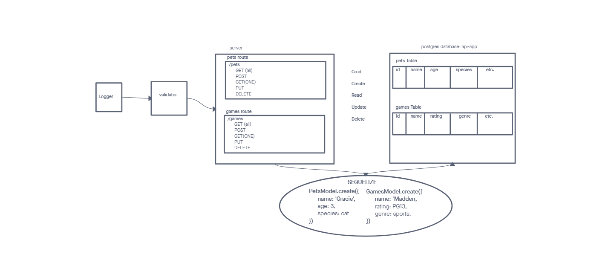

# LAB - Class 03

## Project: basic-api-server

### Author: Seth Pierce

### Problem Domain

  Build a REST API using Express, by creating a proper series of endpoints that perform CRUD operations on a database, using the REST standard

### Links and Resources

- [ci/cd](https://github.com/sethppierce/basic-api-server/actions) (GitHub Actions)
- [prod deployment](https://basic-api-server-dsob.onrender.com/) (when applicable)

### Setup

#### `.env` requirements (where applicable)

- PORT: 3001
- DATABASE_URL=postgres://localhost:5432/api-app?sslmode=disable

#### How to initialize/run your application (where applicable)

- nodemon

#### Features / Routes

- Feature One - Add a Record
- POST - path `/pets and /games`
- Feature Two - Get all Records
- GET - path `/pets and /games`
- Feature Three - Get One Record
- GET - path `/pets/:id and /games/:id`
- Feature Four - Update a Record
- PUT - path `/pets and /games`
- Feature Five - Delete a Record
- DELETE - path `/pets/:id and /games/:id`

#### Tests

- How do you run tests?
  - npm test
- Any tests of note?
  - handles root path
  - handles invalid requests
  - handles errors
  - handles invalid method
  - logs as expected
  - tests all CRUD functionality for `/pets`
  - tests all CRUD functionality for `/games`

#### UML

